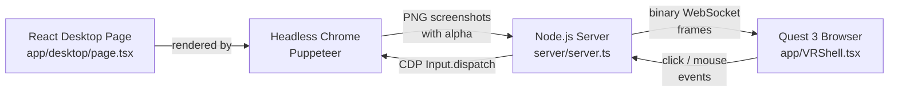

# VR Desktop — System Overview



## How the VR rendering works

The Quest 3 opens the app in its browser. `VRShell.tsx` sets up a Three.js WebXR scene with a **curved CylinderGeometry** panel that wraps around the user. The key steps:

1. **Before XR starts**: an offscreen `<canvas>` (3840x1080) is created and wrapped in a `CanvasTexture`. This must happen synchronously before the XR session — Quest Browser silently drops textures created after XR starts.
2. **WebSocket connection**: the client connects to `ws://.../ws/screencast` and receives binary PNG frames.
3. **Frame decoding**: each binary message is decoded via `createImageBitmap()`, drawn onto the offscreen canvas, and `texture.needsUpdate = true` triggers the GPU upload.
4. **Transparency**: the PNG frames have an alpha channel. The material uses `transparent: true` and `side: THREE.BackSide` (rendering the inside of the cylinder). Areas with alpha=0 show VR passthrough.
5. **Interaction**: VR controller raycasts intersect the curved mesh. Hits are converted to UV coordinates, mapped to pixel positions, and sent back over WebSocket as mouse events.

## How VR connects to Headless Chrome

The Node.js server (`server/server.ts`) is the bridge between the VR client and headless Chrome:

**Chrome → VR (screenshots)**:
- Puppeteer launches Chrome and opens `/desktop` at 3840x1080
- `Emulation.setDefaultBackgroundColorOverride` sets background to `rgba(0,0,0,0)` so Chrome renders with true transparency
- A tight loop calls `Page.captureScreenshot` with `format: "png"` and `omitBackground: true`
- Each PNG (with alpha channel) is sent as a binary WebSocket message to all connected VR clients
- Identical frames are skipped (base64 comparison) to save bandwidth

**VR → Chrome (interaction)**:
- The VR client sends `{ type: "mousemove" | "click", x, y }` JSON messages over the same WebSocket
- The server forwards these as CDP `Input.dispatchMouseEvent` calls to headless Chrome
- Chrome processes them as real mouse events — clicks, hovers, scrolls all work natively

The desktop page itself (`app/desktop/page.tsx`) is just a normal React page with iframes. It has no awareness of VR — it's simply a webpage being screenshotted by a headless browser.

## HTTPS for WebXR

The Quest 3 browser requires **HTTPS** to use WebXR (`navigator.xr`). A plain HTTP page cannot request an XR session, even over LAN.

### Local HTTPS with mkcert (preferred)

We use **mkcert** to create a local Certificate Authority (CA) and generate TLS certificates trusted by both the Mac and the Quest. This keeps all traffic on the LAN — no tunnel, no bandwidth limits.

**How it works**: mkcert creates a root CA on your Mac. Any certificate signed by this CA is trusted by your system. We push the same root CA to the Quest so it also trusts our certs. The Node.js server loads the cert/key from `certs/` and serves HTTPS directly.

**Generating new certificates** (e.g. if they expire or your LAN IP changes):

```bash
mkcert -cert-file certs/cert.pem -key-file certs/key.pem localhost 127.0.0.1 YOUR_LAN_IP
```

**Pushing the root CA to a Quest**:

```bash
# 1. Connect Quest via USB and confirm it appears
adb devices

# 2. Push the root CA
adb push "$(mkcert -CAROOT)/rootCA.pem" /sdcard/rootCA.pem

# 3. On the Quest: Settings > Security > Install certificate
#    Select rootCA.pem, name it anything, mark as CA certificate
```

This only needs to be done once per Quest (unless you regenerate the root CA with `mkcert -install`). Certificates are valid for ~3 years.

## Audio streaming from the Quest

The Quest mic streams audio to the server for server-side processing. The flow:

1. **Quest (VRShell.tsx)**: `getUserMedia({ audio: true })` captures the mic. A `MediaRecorder` encodes it as `audio/webm;codecs=opus` and sends binary chunks every 100ms over a WebSocket to `/ws/audio?role=producer`.

2. **Server (server.ts)**: Each producer connection spawns its own **ffmpeg** process that decodes the WebM/Opus stream to raw PCM (`f32le`, mono, 16kHz). The server computes RMS levels from the PCM samples and broadcasts them as JSON `{ type: "level", rms }` at 10Hz to all consumer WebSocket connections.

3. **Desktop (page.tsx)**: An `AudioMeter` component connects as a consumer to `/ws/audio?role=consumer`, reads the JSON level messages, and renders a live meter bar.

**Key gotchas**:
- **Each producer needs its own ffmpeg** — if two producers share one ffmpeg process, their WebM headers collide and the stream is corrupted. Bind the ffmpeg instance per-connection via closure.
- **Node.js Buffer alignment** — `Buffer.buffer` is a shared ArrayBuffer pool. Creating a `Float32Array(data.buffer, data.byteOffset, ...)` can read wrong bytes if `byteOffset` isn't 4-byte aligned. Always copy first: `new Float32Array(new Uint8Array(data).buffer)`.
- **MediaRecorder chunks aren't self-contained** — individual chunks are continuations of a WebM stream, not standalone files. You can't `decodeAudioData()` on them in the browser. Use ffmpeg server-side or pipe the whole stream.

### Cloudflare Quick Tunnel (fallback)

If local HTTPS isn't an option, run `npm run dev:tunnel` to use a Cloudflare Quick Tunnel (`cloudflared tunnel --url http://localhost:3000`). This creates a public `https://xxx.trycloudflare.com` URL with a valid TLS certificate. No account needed, but all traffic routes through Cloudflare — PNG frames at 3840x1080 are 300-500KB each, so bandwidth adds up fast.
